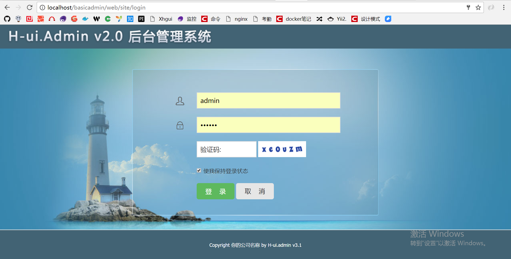
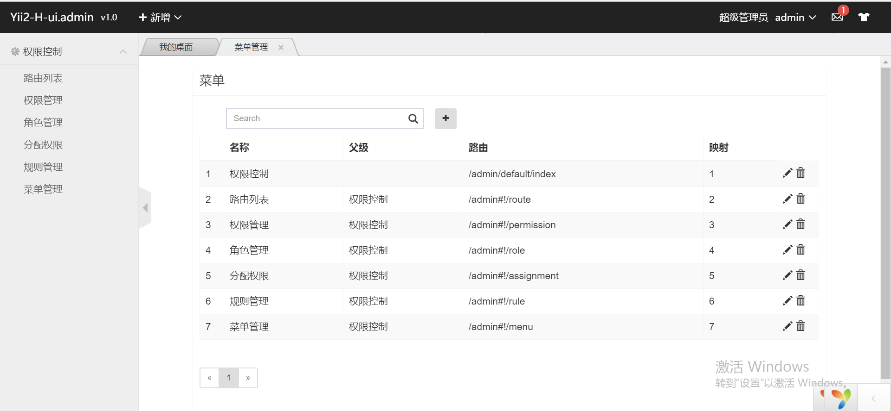

php通用后台
============================

基于[Yii 2 Basic](http://www.yiiframework.com/) [yii2-admin](https://github.com/mdmsoft/yii2-admin) [H-ui.Admin](http://www.h-ui.net/index.shtml) 通用后台.

INSTALLATION
------------

~~~
http://localhost/basic/web/
~~~

### 直接下载或克隆本项目当做自己的后台模板使用

在命令行执行composer update 下载更新依赖

```php
composer update
```

CONFIGURATION
-------------

### 数据库

编辑自己的数据库配置文件 `config/db.php` , 例如:

```php
return [
    'class' => 'yii\db\Connection',
    'dsn' => 'mysql:host=localhost;dbname=yii2basic',
    'username' => 'root',
    'password' => '1234',
    'charset' => 'utf8',
];
```


执行migration创建必要的数据表:
```
yii migrate --migrationPath=@mdm/admin/migrations  //创建menu
yii migrate --migrationPath=@yii/rbac/migrations  //创建权限相关表
yii migrate --migrationPath=@app/migrations //插入数据

```


接下来就可以看见后台页面了:

账号 admin 密码 123456

~~~
http://localhost/basic/web/
~~~






当然这只是一个简单的模板,可能会有很多问题也没解决好,需要你自己去填坑,有不明白的请自行去相应的官网去查.


